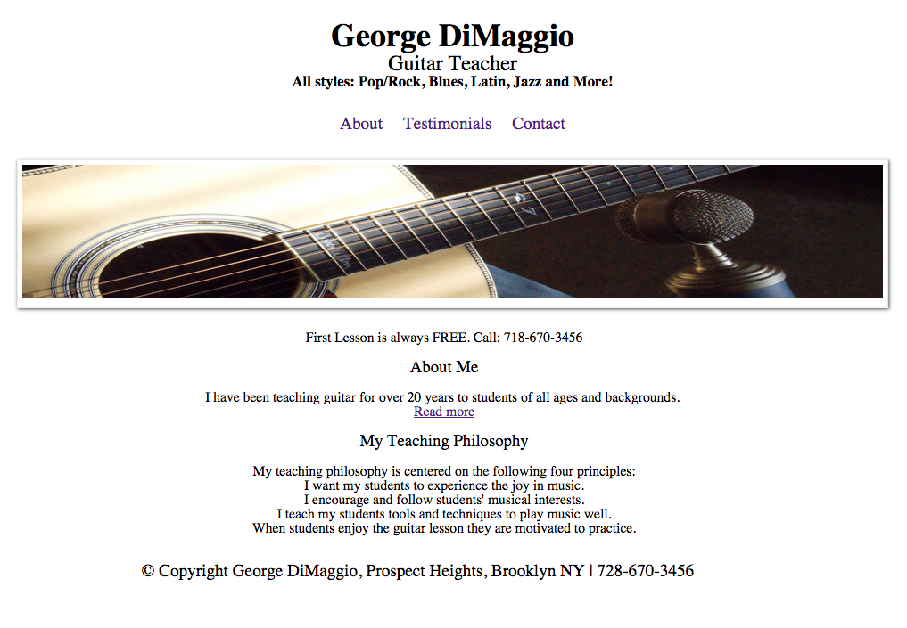

## Summary

George DiMaggio is a guitar teacher looking to promote his guitar teaching practice. The goals of the site are to increase the number of phone and email inquiries by potential students and provide a place on the web where potential students can learn about George's experience and teaching philosophy. This site was one of the first static HTML pages I made according to an assigned [project brief] (project-brief.pdf), [sitemap] (sitemap.png), and [wireframes] (wireframes.pdf).

Built with straight up HTML / CSS / CSS Animations on the frontend.

Hosted on GitHub Pages.

---
Developed by [Matthew Day] (http://unlimitedday.com)